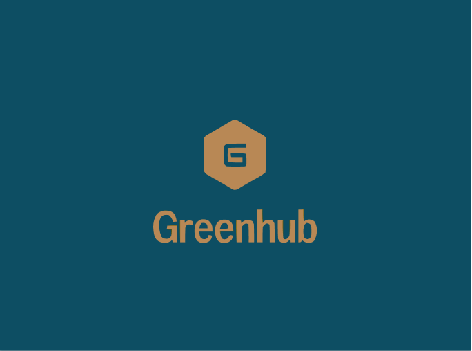

# Green hub (Front)

<p align="center">
  
  
  
  
  
</p>
<p align="center">
    
</p>


## Description

### What is Green hub   ?

Green hub is a company specializing in selling eco-friendly products and services. This project is the front-end part of the e-commerce website. In this website you can command product, services and also a blog part to review product, eco-friendly tutorial etc ...

Professional can also provide services through the platform


### What are the technologies used ?

The frontend part is develop in Vue.js.

### Plugins used :

- unplugin for auto-import icons (using phosphore icons library)
- axios for Http request
- tailwind for css
- daisyUI for component css
- pinia for storing information

## Installation

### Clone the repository
```sh
git clone https://github.com/UgoWadoux/ecom_front.git
```

### Install dependencies
```sh
npm install
```

### Launch developpement server 
```sh
npm run dev
```

